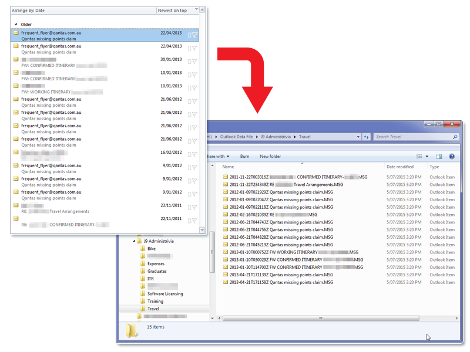

# Kooltou: the MS Outlook Email Backup Tool

This is a tool for backing up Outlook emails to .msg files.

It has been tested with Outlook 2010.

## Users

* [Download: `./dist/kooltou.exe`](./dist/kooltou.exe) - last updated 2015-07-06
	* The program itself. Download and run this.
	* Does not require installation, therefore does not require elevated rights ("administrator rights").
* [Documentation: `./doc/README.md`](./doc/README.md)
	* Describes features, instructions for using the software, and troubleshooting tips.

## Developers

* Package requirements:
	* `easygui`
	* `pytz`
	* `pywin32` (`pip` package `pypiwin32`)
	* `unicodedata`
* Build procedure: `pyinstaller --onefile ./kooltou.py`.

## License

Free software under the MIT license. See `LICENSE.txt`.