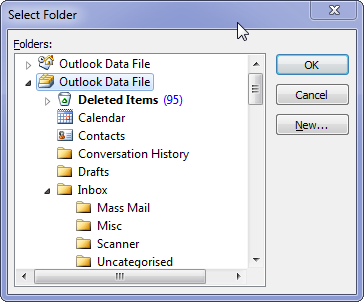
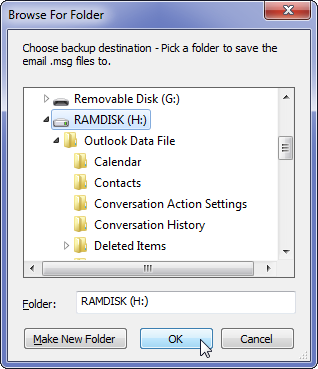
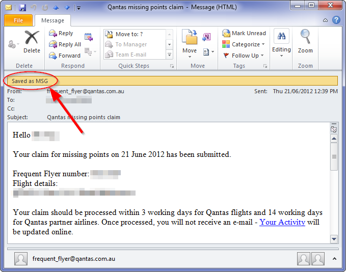
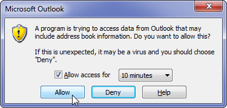

# Kooltou: the MS Outlook Email Backup Tool

## Features

* Saves emails as Outlook .msg files, including all attachments.
* Saves emails older than a specified age (default 60 days), leaving newer emails alone.
* `kooltou` remembers which emails it's already saved, so it won't save the same email twice. 
* Emails are named by date, time (UTC/GMT time) and subject: e.g. `2012-04-27T065436Z E-chartered update from Engineers Australia.MSG`
* The Outlook folder structure is re-created on disk: `H:\Outlook Data File\J9 Administrivia\Graduates`
* Graphical user interface for configuration.

## Usage instructions

### Select what to back up

You select a Outlook folder you want to back up. (Your entire mailbox, `Mailbox - Bloggs, Joe`, if you want.)

### Select where to save the backups

You select where you want to save the files. Here, I have selected the H: drive.

`Kooltou` will automatically create sub-folders i.e. `Inbox`, `Sent Items`... to match your Outlook folder structure.

### Let `kooltou` go to work...

`Kooltou` goes through the Outlook folder you selected, and all its sub-folders, looking for emails older than 60 days (or other age you specify.)

    DEBUG: Item `Qantas missing points claim` of date 
           `2013-04-21 17:11:58+00:00` is 804 days old, archiving...

    DEBUG: Trying to save H:\Outlook Data File\
           J9 Administrivia\Travel\2013-04-21T171158Z Qantas missing
           points claim.MSG

When it finds an email older than 60 days, it saves it to your hard disk as a .MSG file, including all attachments.

Once the email is saved, `Kooltou` tags the email with the `Saved as MSG` tag. This lets `Kooltou` recognise emails it has already saved, so it can ignore them next time `Kooltou` is run.

When the program is finished, it will give a status report before closing:

	INFO: Starting up....
	INFO: Opening Outlook Application...
	INFO: Asking user to select Outlook folder...
	INFO: User selected the folder \\Outlook Data File\J9 Administrivia\Travel
	INFO: Asking user to select filesystem directory...
	INFO: User selected the directory H:\
	INFO: Entering folder \\Outlook Data File\J9 Administrivia\Travel
	INFO: Folder H:\Outlook Data File\J9 Administrivia\Travel already exists.
	INFO: DONE. Processed: 15, Saved: 15, Already archived (skipped): 0
	Press any key to exit...

## Frequently asked questions

### Why is the time/date on the emails different to what I expected?

In Outlook, the times and dates are displayed in your local time zone, i.e. `Australia/Brisbane` (UTC+10:00). If you change time zones, i.e. travel from Brisbane to London, then the times displayed by Outlook will change.

`kooltou` names the emails according to Coordinated Universal Time (UTC), i.e. Greenwich Mean Time (GMT). Note 1 This means that the program will give the same email the same filename, no matter which timezone you are in today.

### Why is it called `kooltou`?

`kooltou` backs up `outlook`.

`kooltou` ↔ `outlook`.

## Troubleshooting

### "A program is trying to access data..."

Depending on your security settings, you may see the following dialog when starting `kooltou`:

This is because `kooltou` needs full access to all information in Outlook in order to save emails. You should **Allow** access.

### Other problems

`kooltou` creates two log files each time it is run:

* `log-[today's date]-summary.txt` - a summarised log of program status. Any errors will be recorded here.
* `log-[today's date]-detailed.txt` - a full log of all program steps, including exactly which emails were looked at, and what `kooltou` decided to do with each email.

If the program encountered an error, then this will be shown in the `-summary.txt` log file:

	INFO: Starting up....
	ERROR: Fatal error in main program.
	Traceback (most recent call last):
	  File "D:/work/vc/python/outlook_dump/outlook_dump.py", line 144, in <module>
	    x = 1 / 0
	ZeroDivisionError: integer division or modulo by zero

 Such errors should be reported to the author, including both the `log-...-summary.txt` and the `log-...-detailed.txt` as part of the correspondence.

----

*Note 1:* UTC and GMT are nearly the same. UTC is defined using an atomic clock, whereas GMT is based on the position of the sun.